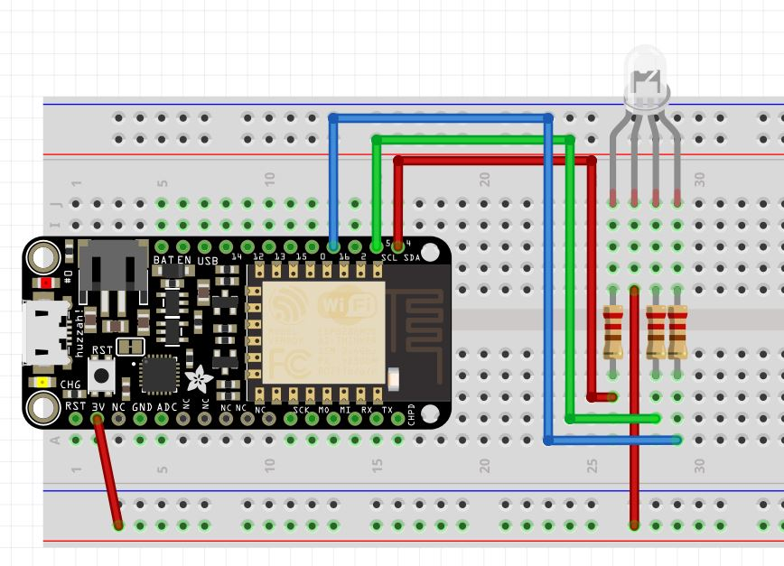

# RGB LED Rainbow

This code allows for a common cathode or common anode RGB LED to rainbow (ROYGBIV) in a loop to display all of the colors. 

### Notes
- You may need to change the pins to other PWM pins based on the board being used.
- The code is set up for a common anode. If using a common cathode, be sure to connect the long pin to ground and comment line 1. 

This was tested on an Adafruit Feather Huzzah with ESP8266. Pin #2 was avoided since this is the same as LED_BUILTIN on this board, however it can be used.

Here's a Fritzing diagram of the test setup:
